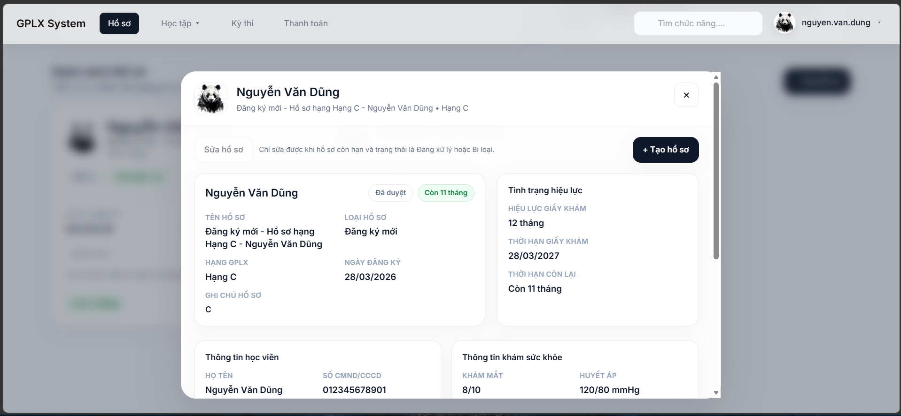
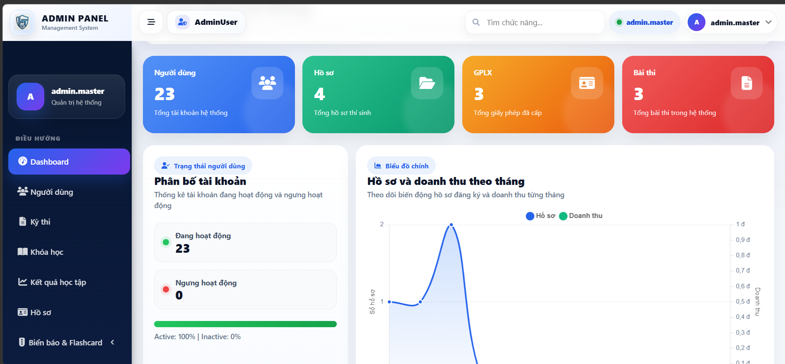
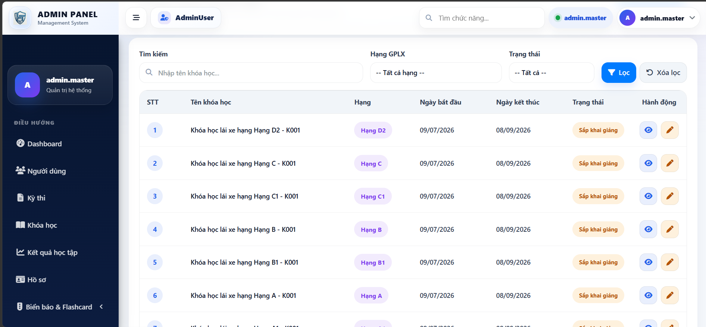
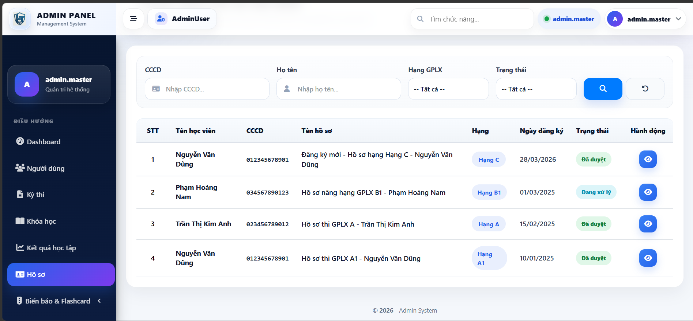
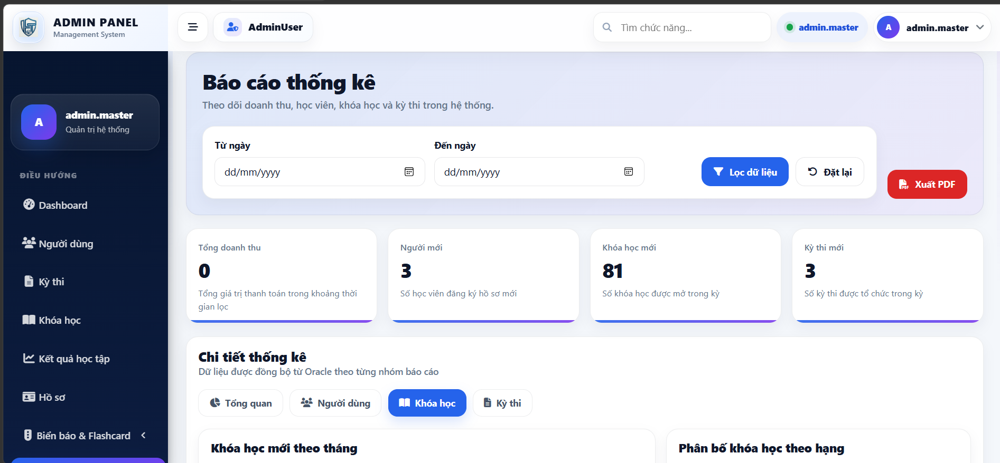
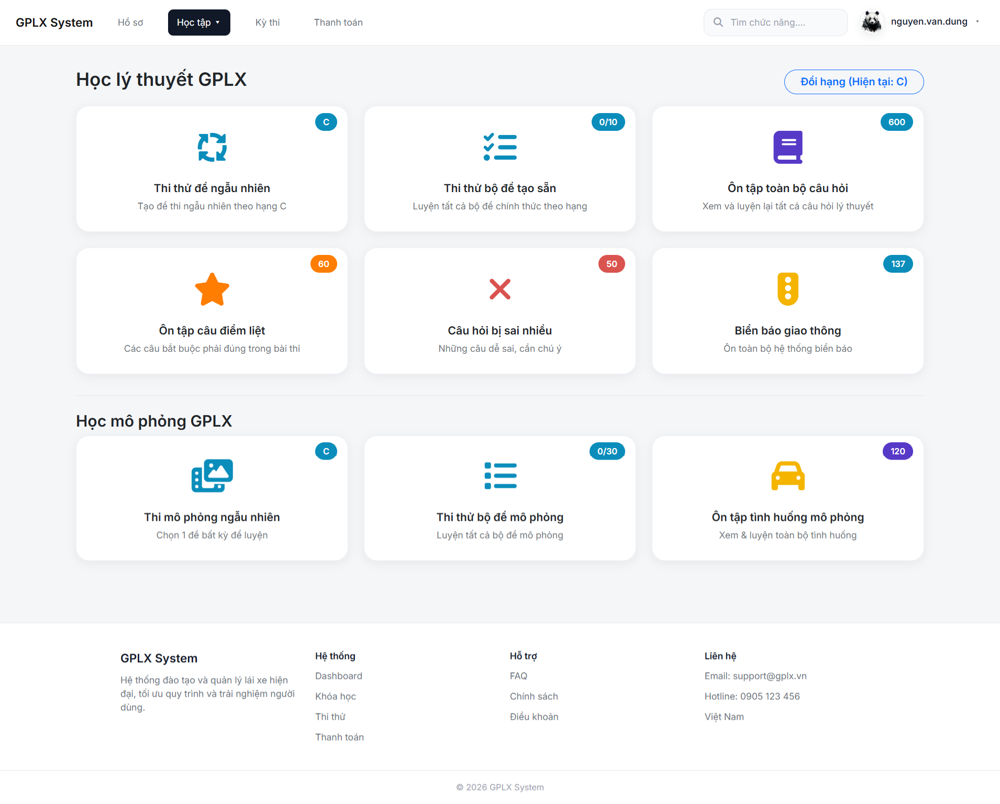
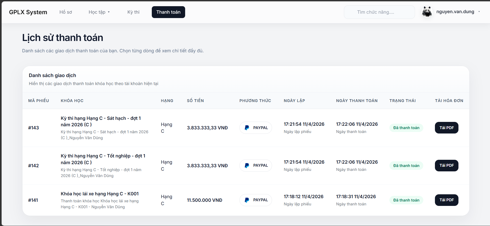
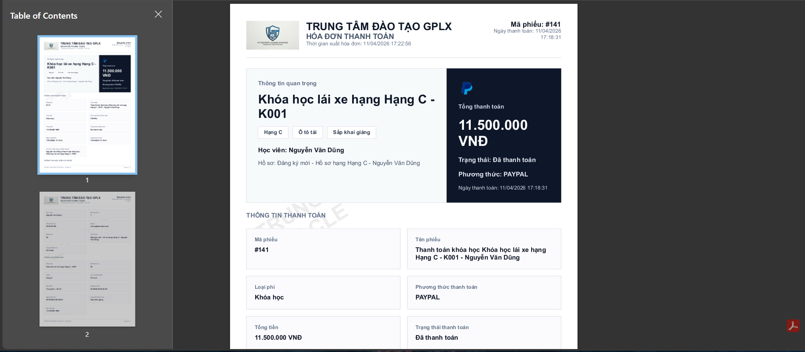
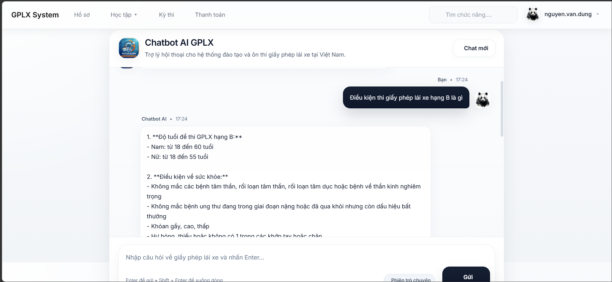

# 🚗 Driving School Management System

A modern ASP.NET Core MVC platform for managing driving-school operations: student onboarding, learning modules, exam scheduling, simulation tests, and online payments.



---

## 📚 Table of Contents

- [About the Project](#-about-the-project)
- [Features](#-features)
- [Tech Stack](#-tech-stack)
- [Installation](#-installation)
- [Usage](#%EF%B8%8F-usage)
- [Project Structure](#%EF%B8%8F-project-structure)
- [API / Configuration](#-api--configuration)
- [Screenshots](#%EF%B8%8F-screenshots)
- [Roadmap](#%EF%B8%8F-roadmap)
- [Contributing](#-contributing)
- [License](#-license)
- [Contact](#-contact)

---

## 📌 About the Project

**Driving School Management System** is a full-stack web application built for digitalizing driving-school workflows.

The system supports:
- Student profile and dossier (`Hồ sơ`) management
- Course registration and learning progress tracking
- Theory training and mock exam modules
- Simulation exam management (`Thi mô phỏng`)
- Multi-gateway payment processing and invoice generation
- Admin dashboard and reporting

It is designed with a layered architecture (Controllers → Services → Data/DTOs) to keep the codebase maintainable and scalable.

---

## ✨ Features

- 🔐 Authentication with OTP verification flow
- 👤 User profile and student dossier management
- 📖 Theory learning modules (flashcards, question bank, practice)
- 🧪 Trial exams and exam registration confirmation
- 🎮 Simulation exam workflow with attempt history
- 💳 Payment integration: VNPay, MoMo, PayPal
- 🧾 Payment history and PDF invoice generation
- 🛠️ Admin management for users, courses, exams, and learning results
- 📊 Dashboard/reporting views for operational monitoring
- 🤖 AI chatbot endpoint integration support

---

## 🧰 Tech Stack


---

## 🚀 Installation

### 1) Clone repository

```bash
git clone https://github.com/haihttt974/driving-school-management.git
cd driving-school-management
```

### 2) Restore dependencies

```bash
dotnet restore driving-school-management.slnx
```

### 3) Create application settings

Create `driving-school-management/appsettings.json` (sample below in [API / Configuration](#-api--configuration)).

### 4) Prepare database

- Set a valid Oracle connection string in `ConnectionStrings:OracleDb`
- Run SQL scripts in:

```bash
driving-school-management/wwwroot/db/
```

### 5) Run the app

```bash
dotnet run --project driving-school-management/driving-school-management.csproj
```

Default route:

```text
https://localhost:<port>/
```

---

## ▶️ Usage

### Developer workflow

```bash
# Build
dotnet build driving-school-management/driving-school-management.csproj

# Run
dotnet run --project driving-school-management/driving-school-management.csproj
```

### Example use cases

1. Register/login with OTP verification.
2. Create student dossier (`Hồ sơ`) and select license category.
3. Enroll in a course and complete theory learning modules.
4. Start payment via VNPay/MoMo/PayPal.
5. Track payment history and exam registration status.
6. Admin reviews users, courses, and exam schedules from dashboard.

---

## 🗂️ Project Structure

```text
driving-school-management/
├── driving-school-management.slnx
├── README.md
└── driving-school-management/
    ├── Controllers/        # MVC controllers (Auth, Payment, Exams, Admin...)
    ├── Services/           # Business logic, integrations, reporting
    ├── Models/             # Entities, DbContext, DTOs
    ├── ViewModels/         # View-specific models
    ├── Views/              # Razor views
    ├── Helpers/            # Utility helpers and extensions
    ├── Librarys/           # Payment utility library (VNPay)
    ├── Templates/          # Email templates
    ├── Configs/            # Prompt/system configuration
    ├── wwwroot/            # Static assets + SQL scripts
    ├── Program.cs          # App bootstrap and DI registrations
    └── driving-school-management.csproj
```

---

## 🔧 API / Configuration

This project reads configuration from `appsettings.json` and environment variables.

### Minimal `appsettings.json` example

```json
{
  "ConnectionStrings": {
    "OracleDb": "User Id=...;Password=...;Data Source=..."
  },
  "EmailSettings": {
    "SmtpHost": "smtp.example.com",
    "SmtpPort": 587,
    "SenderName": "Driving School",
    "SenderEmail": "noreply@example.com",
    "Username": "smtp-user",
    "Password": "smtp-password"
  }"VnPay": {
    "TmnCode": "your-tmn-code",
    "HashSecret": "your-hash-secret",
    "BaseUrl": "https://sandbox.vnpayment.vn/paymentv2/vpcpay.html",
    "Locale": "vn",
    "CurrCode": "VND",
    "OrderType": "other"
  },
  "PayPal": {
    "Mode": "sandbox",
    "ClientId": "your-paypal-client-id",
    "ClientSecret": "your-paypal-client-secret"
  },
  "MOMO": {
    "UseSandbox": true,
    "Endpoint": "https://test-payment.momo.vn",
    "PartnerCode": "your-partner-code",
    "AccessKey": "your-access-key",
    "SecretKey": "your-secret-key"
  },
  "AiSettings": {
    "ApiKey": "your-ai-api-key",
    "Model": "your-model-name",
    "BaseUrl": "https://api.openai.com/v1"
  }
}
```

> ✅ Tip: Use environment variables or secret managers for production secrets.

---

## 🖼️ Screenshots

<p align="center">
  <sub>Selected product views from the Driving School Management System</sub>
</p>

<br/>

<table>
  <tr>
    <td align="center" width="50%">
      
      <br/><br/>
      <b>Admin Dashboard</b>
      <br/>
      <sub>System overview with KPIs, charts, and operational summary.</sub>
    </td>
    <td align="center" width="50%">
      
      <br/><br/>
      <b>Course Management</b>
      <br/>
      <sub>Manage courses, license classes, schedules, and status.</sub>
    </td>
  </tr>
  <tr>
    <td align="center" width="50%">
      
      <br/><br/>
      <b>Student Profiles</b>
      <br/>
      <sub>Track dossier information, registration date, and approval status.</sub>
    </td>
    <td align="center" width="50%">
      
      <br/><br/>
      <b>Reports & Analytics</b>
      <br/>
      <sub>Statistical reports with filters and export-ready workflow.</sub>
    </td>
  </tr>
  <tr>
    <td align="center" width="50%">
      
      <br/><br/>
      <b>Learning & Simulation</b>
      <br/>
      <sub>Theory practice, mock exams, and simulation training modules.</sub>
    </td>
    <td align="center" width="50%">
      
      <br/><br/>
      <b>Payment History</b>
      <br/>
      <sub>View transactions, payment methods, invoice status, and downloads.</sub>
    </td>
  </tr>
  <tr>
    <td align="center" width="50%">
      
      <br/><br/>
      <b>Invoice PDF</b>
      <br/>
      <sub>Automatically generated invoice document for completed payments.</sub>
    </td>
    <td align="center" width="50%">
      
      <br/><br/>
      <b>AI Chatbot</b>
      <br/>
      <sub>Integrated assistant for driving-license guidance and user support.</sub>
    </td>
  </tr>
</table>

---

## 🛣️ Roadmap

- [x] Core MVC architecture and module separation
- [x] Oracle integration with stored-procedure-based services
- [x] Multi-payment support (VNPay, MoMo, PayPal)
- [x] Admin dashboards and report tabs
- [ ] Add automated unit/integration tests
- [ ] Add Dockerized development setup
- [ ] Add CI/CD pipeline (build + lint + test)
- [ ] Add OpenAPI/Swagger documentation for endpoints
- [ ] Improve role/permission granularity

---

## 🤝 Contributing

Contributions are welcome.

1. Fork the repository.
2. Create a feature branch:

   ```bash
   git checkout -b feat/your-feature-name
   ```

3. Commit your changes:

   ```bash
   git commit -m "feat: add your feature"
   ```

4. Push branch:

   ```bash
   git push origin feat/your-feature-name
   ```

5. Open a Pull Request with clear description and test notes.

---

## 📄 License

This project is licensed under the **MIT License**.

---

## 📬 Contact

For technical discussions or collaboration:

- Repository owner/maintainer: [haihttt974](https://github.com/haihttt974)
- Email: `leduyhai090704@gmail.com`
- Issues: open a ticket in this repository
